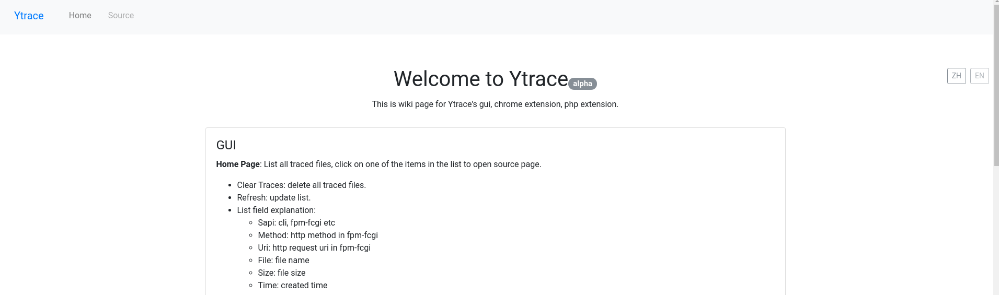
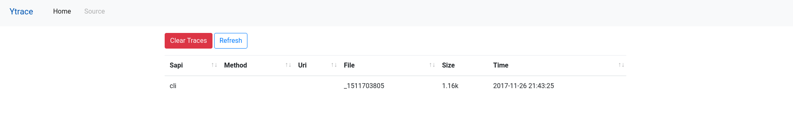
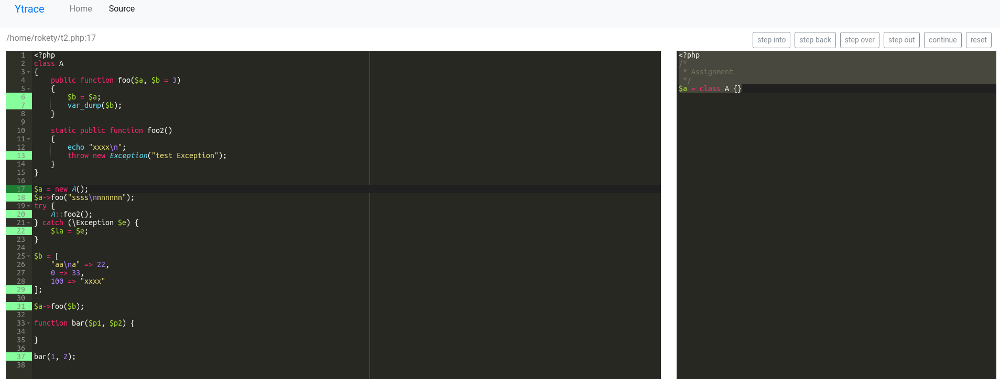

本项目为 [ytrace](https://github.com/yangxikun/ytrace)提供了web ui界面，对应的还有[ytrace_chrome_extension](https://github.com/yangxikun/ytrace_chrome_extension).

## 安装
* git clone 当前项目
* composer install
* 在项目的根目录，执行`php -S localhost:8088`

> 默认的，ytrace_gui会通过ini_get获取ytrace.output_dir的值。如果需要的话，你可以通过编辑`index.php`，修改`//define('YTRACE_OUTPUT_DIR', '/tmp/ytrace/');`，以设置ytrace的输出目录。

## Wiki
__Home 页面__: 列出所有的跟踪文件, 通过点击列表中的某行记录打开Source 页面。
+ Clear Traces: 删除所有的跟踪文件。
+ Refresh: 刷新列表。
+ 列表字段说明：
  - Sapi: cli, fpm-fcgi 等
  - Method: fpm-fcgi中的http 请求方法
  - Uri: fpm-fcgi中的http 请求路径及参数
  - File: 跟踪文件名
  - Size: 跟踪文件大小
  - Time: 跟踪文件创建时间

__Source Page__: 显示跟踪内容详情。
+ 左边模块显示源码文件，右边模块显示跟踪到的变量值。
  - 只跟踪赋值和函数调用
  - ++、--、+=、/=、-=、*=、%=等，显示的值是这些运算符执行之前的值
  - PHP 7无法获取到扩展函数的参数名称（无法显示参数名称的会显示为$...）
+ 被执行过的代码行，行号会以绿色高亮出来，深绿色表示当前执行所在的行
  - 点击高亮的行号，可以将执行跳转至对应行
  - ctrl+点击行号，可以设置或取消断点（断点的行号会以红色高亮）
+ 执行操作:
  - step into: 同gdb
  - step back: 根据你的执行历史，往回执行
  - step over: 同gdb
  - step out: 同gdb
  - continue: 同gdb，执行到下一个断点
  - reset：重置执行过程
+ 快捷键:
  - ctrl+o: 打开最新10个跟踪文件的列表浮框
  - ctrl+p: 打开被跟踪到的源码文件的列表浮框，只能在Source 页面使用
  - ctrl+r: 打开当前显示的源码文件函数/方法的列表浮框，只能在Source 页面使用
  - ctrl+b: 打开断点列表浮框，只能在Source 页面使用
